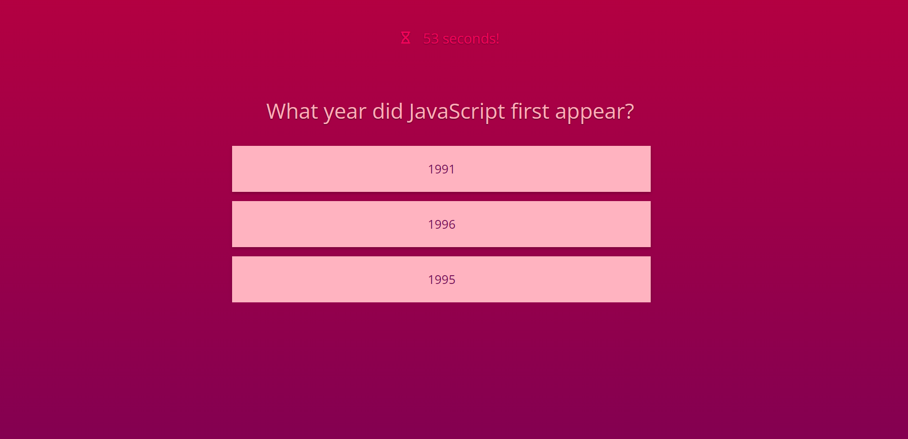

# Code-Quiz

## Description

This timed code quiz tests your JavaScript knowledge! The user must answer all quiz questions in sixty seconds before the timer at the top of the page runs out. Wrong answers subtract three seconds from the clock. Users are shown their current and previous saved score at the end of the quiz. This application was built using JavaScript and jQuery for Denver University's Coding Boot Camp as part of a challenge assignment.

## Installation

N/A

## Usage

To play the code quiz game, begin by navigating to https://msjamesm.github.io/Code-Quiz in your browser. A button ("Can you beat my code quiz?") will appear at the bottom of the welcome page. Click the button to begin the timed quiz. Select your answers, and choose wisely! Wrong answers subtract three seconds from the clock. You will see your score at the end of the quiz. To retake, simply refresh the page.

## Screenshot

## Credits

https://jqueryui.com

https://fonts.google.com (font is <i>"Open Sans"</i>, designed by Steve Matteson)

https://www.w3schools.com/

## License

N/A
